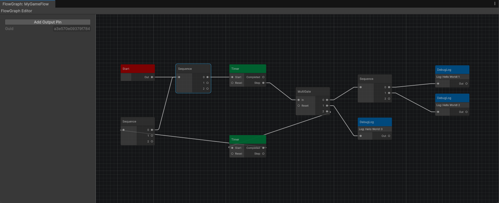

<h1 align="center">  
 
 
 Game Flow
</h1>

a graph based high level game flow Implementation inspired by [FlowGraph](github.com/MothCocoon/FlowGraph) for Unreal


<p align="center">
  <a href="#about">About</a> •
  <a href="#installation">Installation</a> •
  <a href="#features">Features</a> •
  <a href="#documentation">Documentation</a> •
</p>

# About

# Installation

using Unity Package Manager:

add a package to 

```
git@github.com:soraphis/UnityGameFlow.git
```

# Features

A graph based editor to store high level game flow concepts in assets.

An easy way to implement custom nodes for your own game.

## Planned Features

- Save and Load API
- More Built-in Nodes
- Nicer Custom Inspector for Assets
- Rewrite using [Unity Graph Toolkit](https://discussions.unity.com/t/unity-s-graph-toolkit-experimental-available-today-in-unity-6-2/1664909)

# Documentation

// TODO, add Tutorials to:

- Create a Custom Node
- ...
